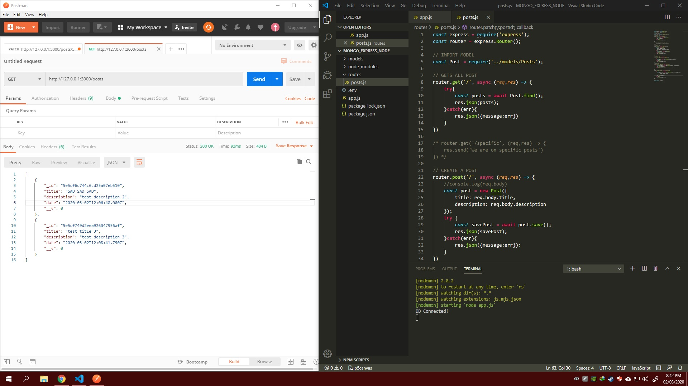

# DAY 1 : Build A Restful Api With Node.js Express & MongoDB

| Date | March 2,2020 |
| ------ | ------ |
| START | 6:30PM |
| END | 8:20PM |

### What I learned

  - Basic Server Setup using Express with Basic Get Routing
  - Connecting to MongoDb using Mongoose on MongoDB ATlas
  - Creation of Model using Mongoose
  - Creation of CRUD API 

## PREVIEW.

NOTE : 
> Followed course/tutorial -> Dev Ed : https://www.youtube.com/watch?v=vjf774RKrLc

> Almost give up because it doesn't save record on POST, but youtube comments save my day.