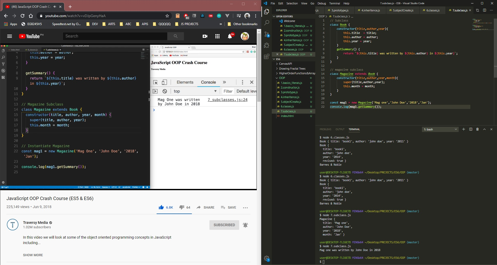

# DAY 14 : JavaScript OOP (ES5 & ES6)

| Date | March 15,2020 |
| ------ | ------ |
| START |4:00PM |
| END | 4:58PM |

### Learned 
>Basic literals
>Prototype
>ObjectCreate
>Constructor
>Inheritance
>Classes/Subclass

## PREVIEW.

NOTE : 
> Followed course/tutorial/guide -> Traversy Media :  https://youtube.com/watch?v=vDJpGenyHaA
