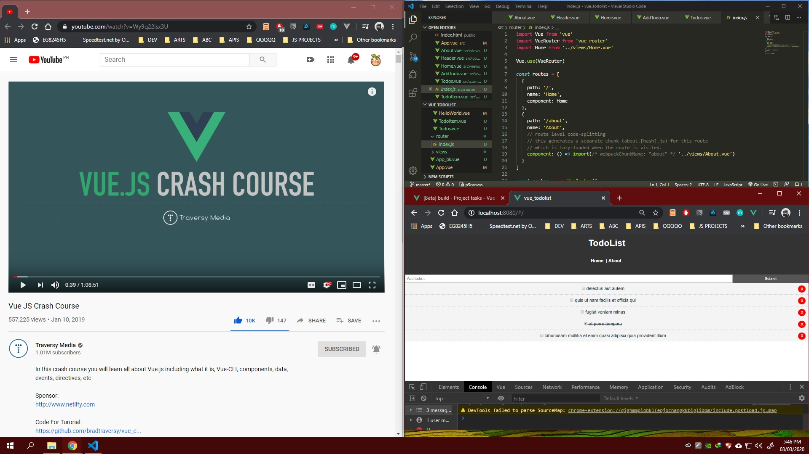

# DAY 2 : VueJS Basics

| Date | March 3,2020 |
| ------ | ------ |
| START | 3:00PM |
| END | 5:45PM |

### What I learned

  - Vue UI/VUE CLI (serve,build)
  - Data binding,Events,Model
  - Components
  - Vue Router(views,router)

## PREVIEW.

NOTE : 
> Followed course/tutorial -> Traversy Media : https://www.youtube.com/watch?v=Wy9q22isx3U&t=1s
