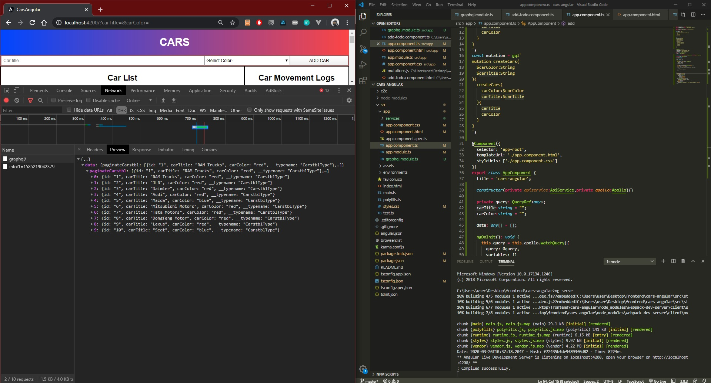

# DAY 25: Django Graphql + Angular Part 2

| Date | March 25,2020 |
| ------ | ------ |
| START |1:06PM |
| END | 2:23PM |

> Able to call a Django Graphql Query and Mutation on Angular using apollo-angular

>SOURCE :  https://www.techiediaries.com/graphql-tutorial/

## PREVIEW.

