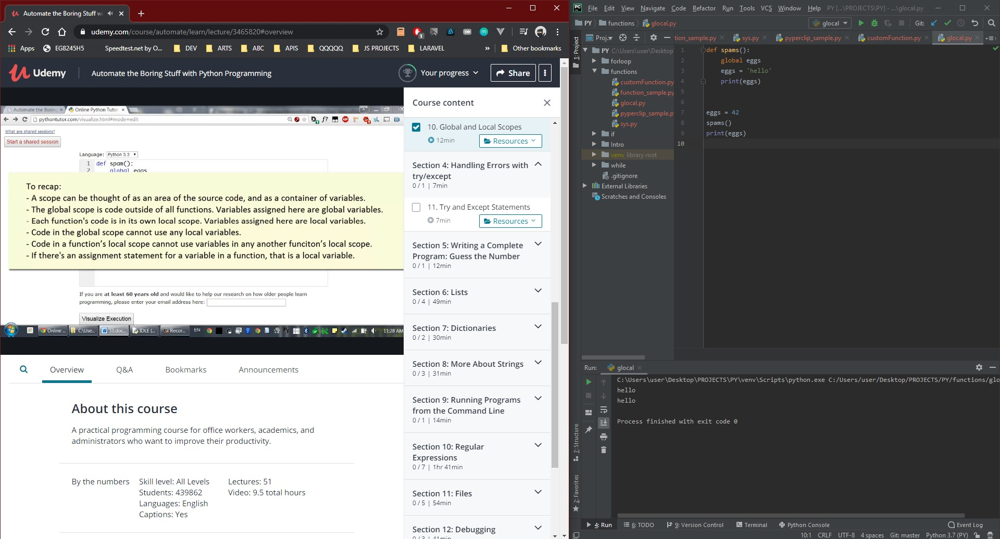

# DAY 33 : Automate Boring Stuff w/ Python - Part 1

## Section 1 -Basics

## Section 2 -Flow Chart

> if/elif/else

> while loop (break,continue

> for loop

## Section 3 -Functions

> Random(randint),Sys,math

> pip install pyperclip

> custom function

> global/local variable

| Date | April 3,2020 |
| ------ | ------ |
| START |2:44PM |
| END | 4:15PM |

> Udemy Course : Automate Boring Stuff w/ Python

## PREVIEW.

