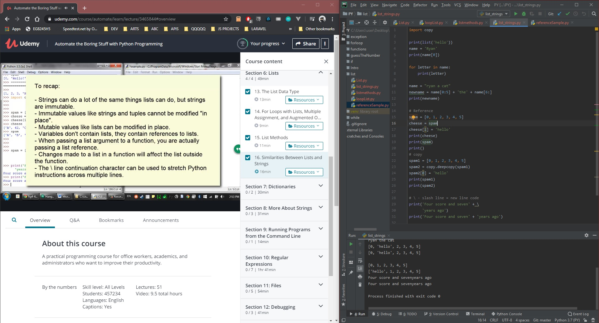

# DAY 35 : Automate Boring Stuff w/ Python - Part 3

## Section 6- List

> List,Loop,Methods

> String * list (reference and copy.deepcopy)

> Slash( \ ) - new line code

| Date | April 5,2020 |
| ------ | ------ |
| START |6:22PM |
| END | 8:00PM |

> Udemy Course : Automate Boring Stuff w/ Python

## PREVIEW.

