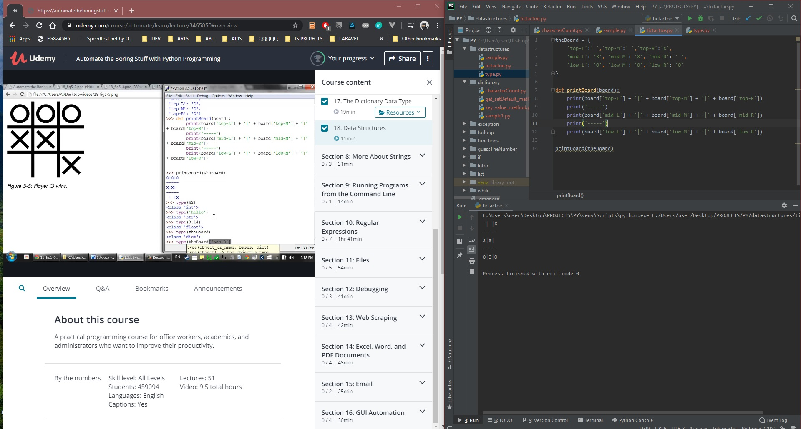

# DAY 36 : Automate Boring Stuff w/ Python - Part 4

## Section 7- Dictionary

> Dictionary data type (setdefault,get method) (pprint)

> Data Structures (Tictactoe Sample Data Representation)

| Date | April 6,2020 |
| ------ | ------ |
| START |7:00PM |
| END | 8:00PM |

> Udemy Course : Automate Boring Stuff w/ Python

## PREVIEW.

