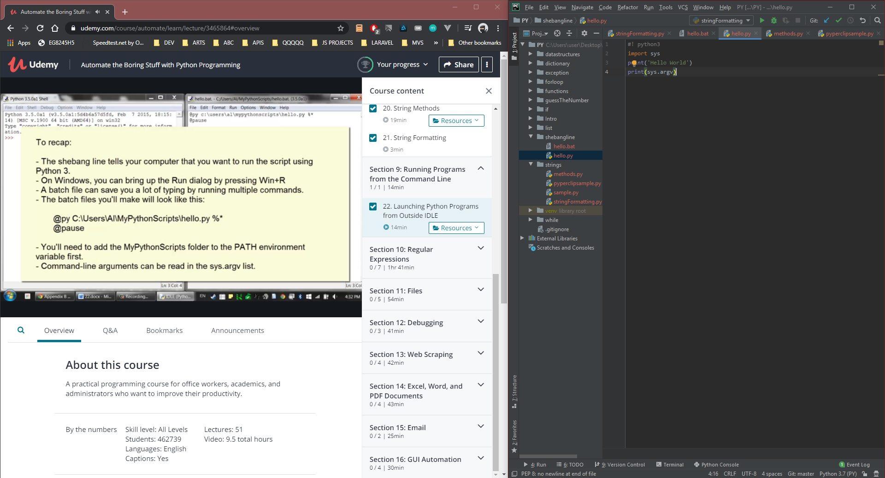

# DAY 37 : Automate Boring Stuff w/ Python - Part 5

## Section 8 - More about strings
> Adv. String Syntax,String methods,String Format

## Section 9 - Run Program from CMD 
> (Env. Variables,Shebang line)

| Date | April 7,2020 |
| ------ | ------ |
| START |5:38PM |
| END | 6:49PM |

> Udemy Course : Automate Boring Stuff w/ Python

## PREVIEW.

