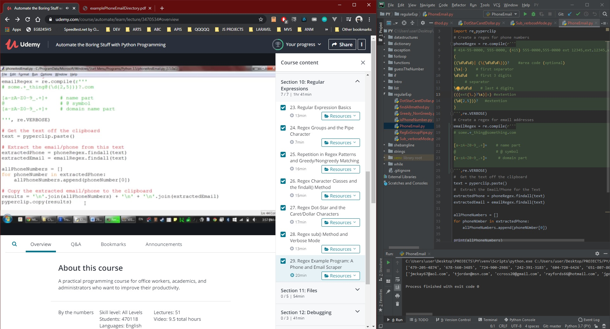

# DAY 38 : Automate Boring Stuff w/ Python - Part 6

## Section 10 - Regular Expressions
> Basics,Groups,PipeChar,FindAll Search Method
> Greedy and non Greedy Matching
> Sub() and Verbox Mode
> Regex Example ( Phone and Email Scrapper)

| Date | April 8,2020 |
| ------ | ------ |
| START |5:00PM |
| END | 7:17PM |

> Udemy Course : Automate Boring Stuff w/ Python

## PREVIEW.

