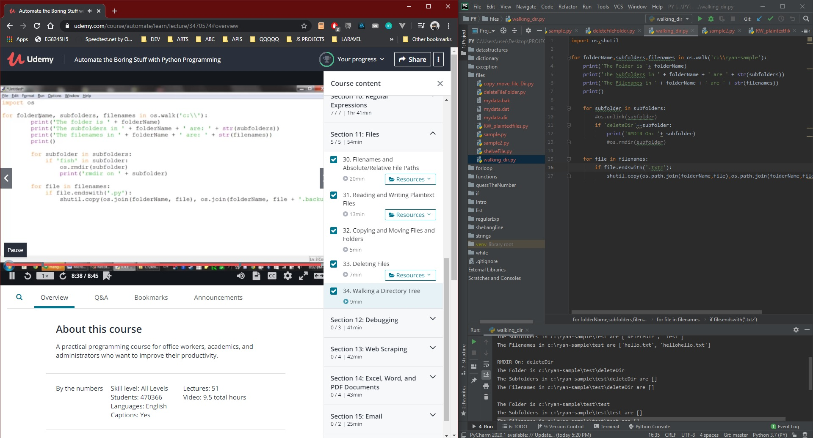

# DAY 39 : Automate Boring Stuff w/ Python - Part 7

## Section 11 - Files
> Filenames,Absolute//Relative Paths
> Read/Write Plaintext Files (open)
> Copy/Move File|Folders (shutil)
> Delete files ( rmdir,shutil.rmtree,unlink,send2trash)
> Walking a Dir Tree ( os.walk )

| Date | April 9,2020 |
| ------ | ------ |
| START |5:20PM |
| END | 6:49PM |

> Udemy Course : Automate Boring Stuff w/ Python

## PREVIEW.

