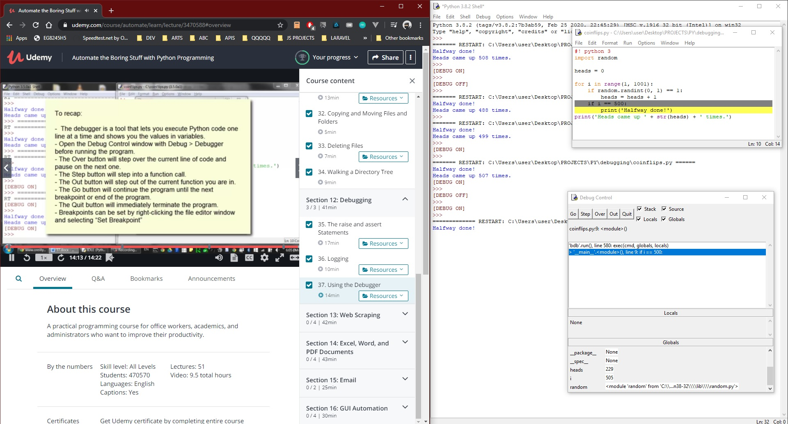

# DAY 40 : Automate Boring Stuff w/ Python - Part 8

## Section 12 - Debugging
> raise/assert Statement
> Logging (debug,info,warning,error,critical)
> Use of IDLE Debugger (Go,Step,Over,Out,Breakpoint)

| Date | April 10,2020 |
| ------ | ------ |
| START |5:08PM |
| END | 6:41PM |

> Udemy Course : Automate Boring Stuff w/ Python

## PREVIEW.

