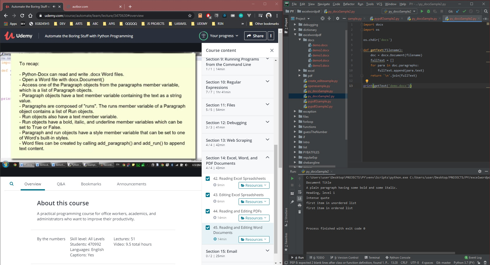

# DAY 42 : Automate Boring Stuff w/ Python - Part 10
## Section 14 - Excel,Word,Pdf Docs
> Read/Write Excel SpreadSheets (openpyxl)
> Read/Write PDF Files (PyPDF2)
> Read/Write Word Docs (python-docx [docx])

| Date | April 12,2020 |
| ------ | ------ |
| START |7:04PM |
| END | 8:00PM |

> Udemy Course : Automate Boring Stuff w/ Python

## PREVIEW.

