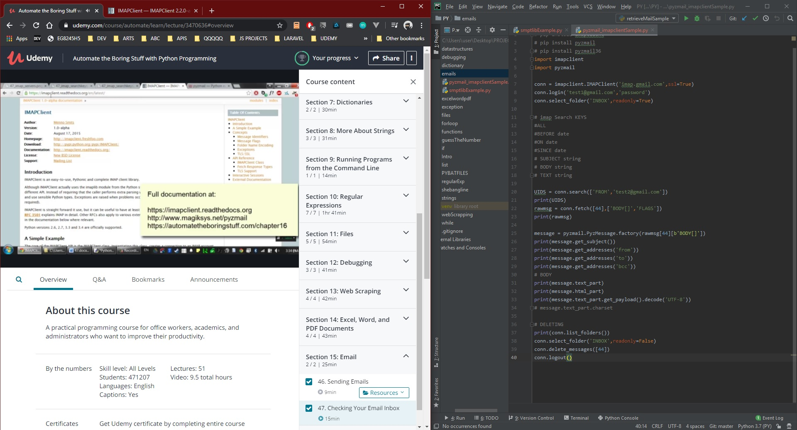

# DAY 43 : Automate Boring Stuff w/ Python - Part 11

## Section 15 - EMAIL
> Sending emails (smtplib)
> Checking Email Inbox[read/del] (imapclient,pyzmail36)

| Date | April 13,2020 |
| ------ | ------ |
| START |6:50PM |
| END | 7:38PM |

> Udemy Course : Automate Boring Stuff w/ Python

## PREVIEW.

