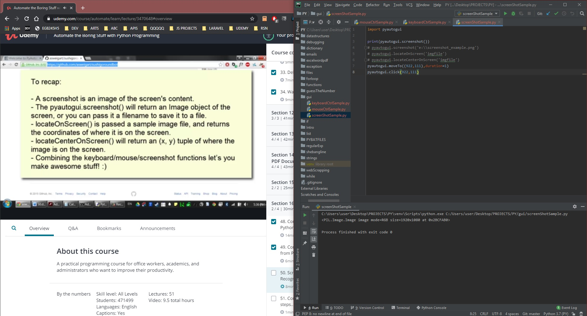

# DAY 43 : Automate Boring Stuff w/ Python - Part 12 Final

## Section 15 - GUI Automation
> Controlling Mouse,Keyboard (pyautogui)
> Screenshot && Image Recognition

| Date | April 14,2020 |
| ------ | ------ |
| START |8:25PM |
| END | 9:05PM |

> Udemy Course : Automate Boring Stuff w/ Python

## PREVIEW.

