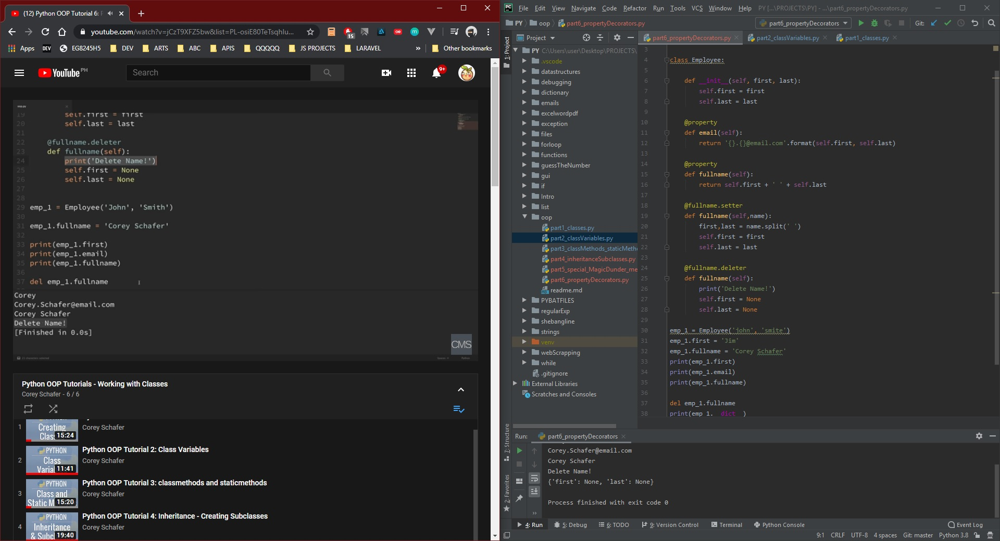

# DAY 50 : Python OOP - Part 2

> Inheritance (creating subclasses)
> Special (Magic/Dunder) Methods
> Property Decorator(getter,setter,deleter)

| Date | April 20,2020 |
| ------ | ------ |
| START | 5:36PM |
| END | 6:25PM |

## PREVIEW.

NOTE : 
> Followed course/tutorial/guide -> https://www.youtube.com/watch?v=ZDa-Z5JzLYM&list=PL-osiE80TeTsqhIuOqKhwlXsIBIdSeYtc
