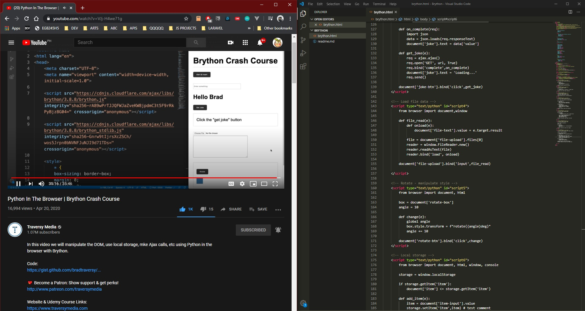

# DAY 51 : Brython ( A Python 3 implementation for client-side web programming )

A Python 3 implementation for client-side web programming
> https://brython.info
> text bind
> template variable
> ajax call
> load file data
> Manipulate style
> local storage

TUT : https://youtube.com/watch?v=VJj-H4we71g

| Date | April 21,2020 |
| ------ | ------ |
| START | 6:37PM |
| END | 7:17PM |

## PREVIEW.

