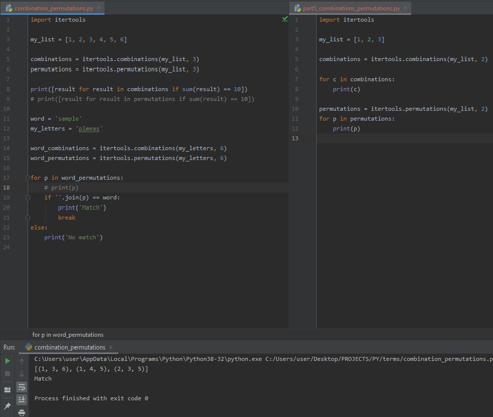

# DAY 55 : Programming Terms - Part 4

> Combinations && Permutation Concept (Python itertools)

| Date | April 25,2020 |
| ------ | ------ |
| START | 4:32PM |
| END | 4:42PM |

## PREVIEW.

NOTE : 
> Followed course/tutorial/guide -> https://www.youtube.com/watch?v=swU3c34d2NQ&list=PL-osiE80TeTsnP0Nl1UDY8VZAlHu1m_MQ
> https://www.youtube.com/watch?v=Qk0zUZW-U_M&t=341s
