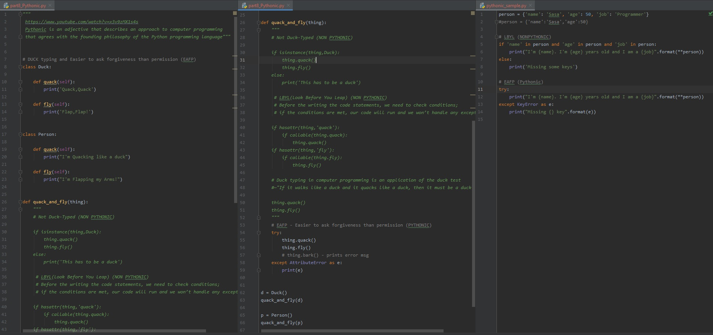

# DAY 58 : Programming Terms - Part 7

## Pythonic concepts
> Duck typing
> EAFP(Easier to ask forgiveness than permission) (Pythonic)
> LBYL(Look Before You Leap) (NON PYTHONIC)

| Date | April 28,2020 |
| ------ | ------ |
| START | 5:12PM |
| END | 5:45PM |

## PREVIEW.

NOTE : 
> Followed course/tutorial/guide -> https://youtube.com/watch?v=x3v9zMX1s4s
