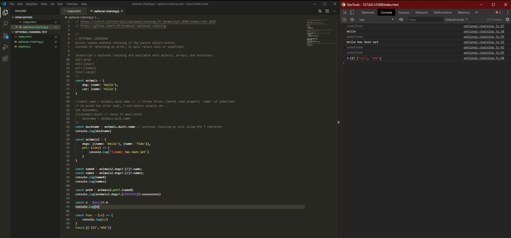

# DAY 66 : ES2020-Optional chaining

> Access values without checking if the parent object exists. 
Instead of returning an error, it will return null or undefined. 

| Date | May 6,2020 |
| ------ | ------ |
| START | 5:20PM |
| END | 5:56PM |

## PREVIEW.

NOTE : 
> Followed course/tutorial/guide ->
> https://scotch.io/tutorials/optionalchaining-in-javascript-2020-ecmascript-2020
> https://github.com/tc39/proposal-optional-chaining

