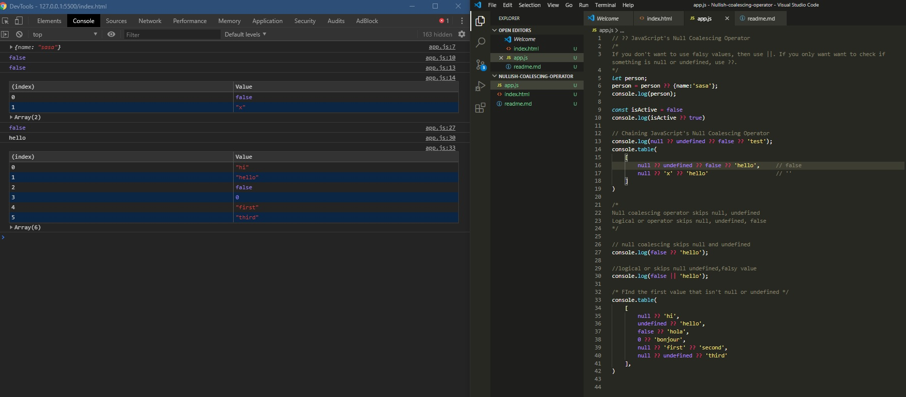

# DAY 68 : ES2020-?? Null Coalescing Operator

> Null coalescing operator will go through a list and return the first item that is not null or undefined.
> (??) Null coalescing operator skips null, undefined
> (||) Logical or operator skips null, undefined, false

| Date | May 8,2020 |
| ------ | ------ |
| START | 1:50PM |
| END | 2:05PM |

## PREVIEW.

NOTE : 
> Followed course/tutorial/guide ->
> https://scotch.io/tutorials/javascripts-null-coalescing-operator

