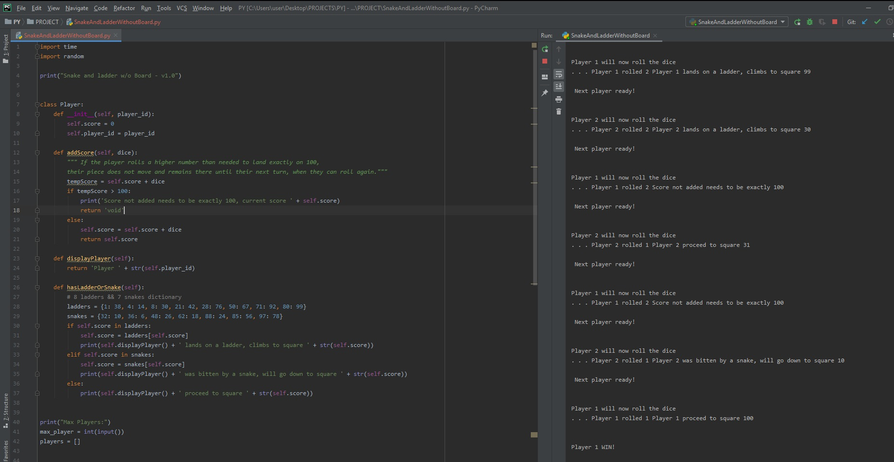

# DAY 70 : Snake and ladder w/o Board.PY

> Python Practice using :
> list for players
> classes for players info,score
> dict for the ladders & snekss
> loops for the game simulation
> random for rolling the dice

| Date | May 10,2020 |
| ------ | ------ |
| START | 5:48PM |
| END | 7:51PM |

## PREVIEW.

