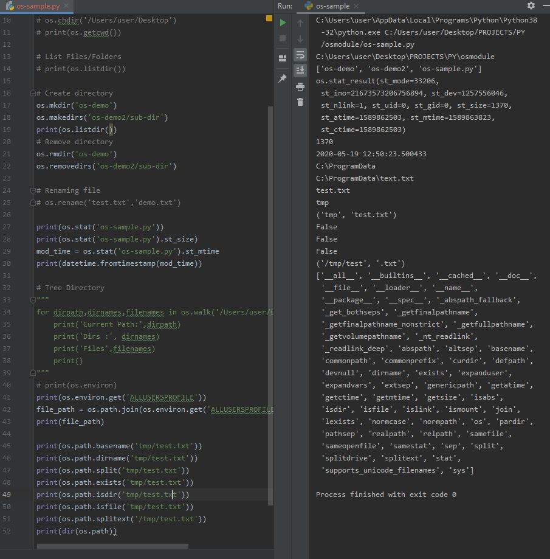

# DAY 79 : Python OS Module
> navigate the file system, obtain file information, rename files, search directory trees, fetch environment variable
| Date | May 19,2020 |
| ------ | ------ |
| START | 12:27PM |
| END | 12:53PM |

> TuT: https://www.youtube.com/watch?v=tJxcKyFMTGo
## PREVIEW.

