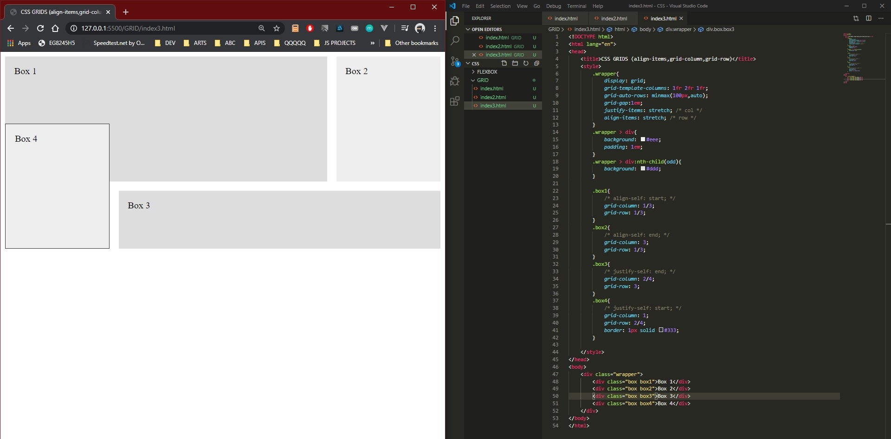

# DAY 8 : CSS GRID

| Date | March 9,2020 |
| ------ | ------ |
| START |4:40PM |
| END | 5:12PM |

### Learned 
> grid-template-columns (% , fr)
> grid-column-gap,grid-row-gap,grid-gap
> align-self,justify-self
> grid-column,grid-row

## PREVIEW.

NOTE : 
> Followed course/tutorial/guide -> Traversy Media : https://www.youtube.com/watch?v=jV8B24rSN5o&t=31s
